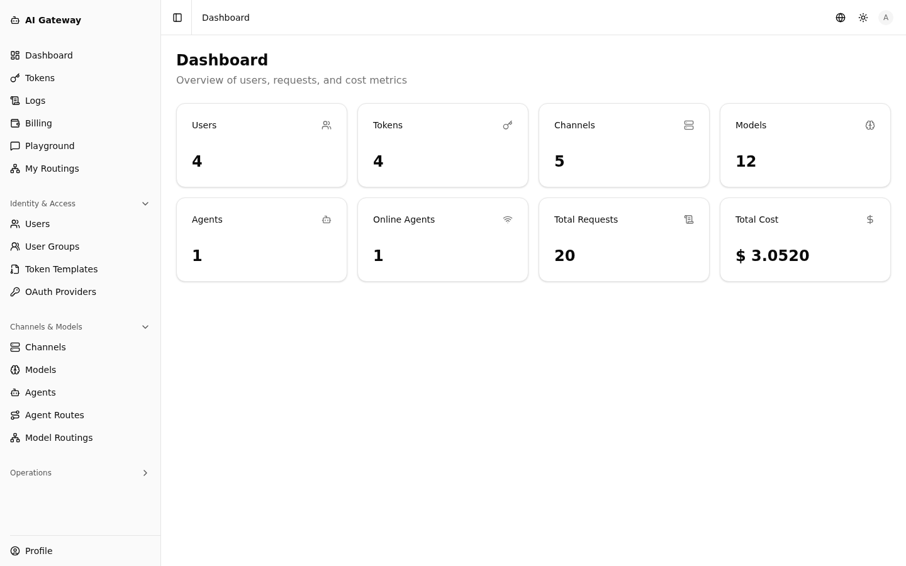
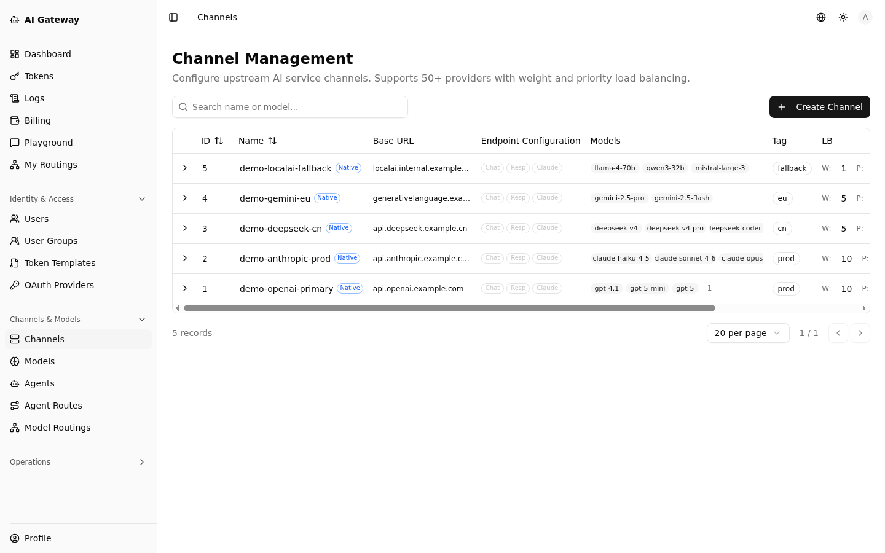
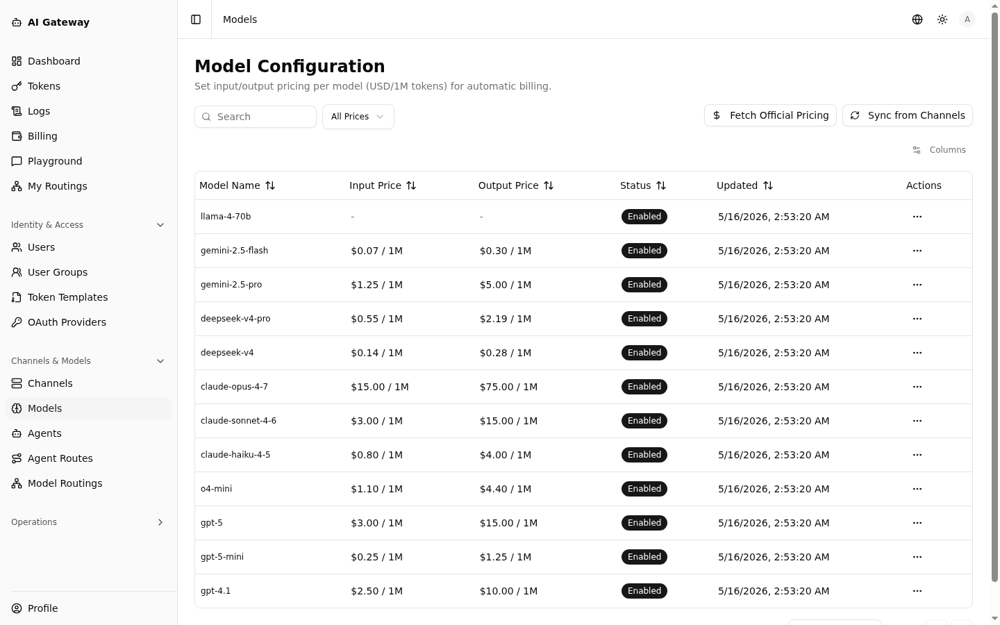
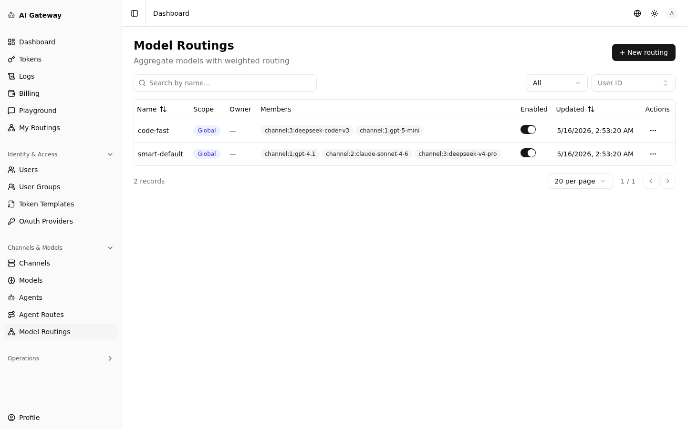
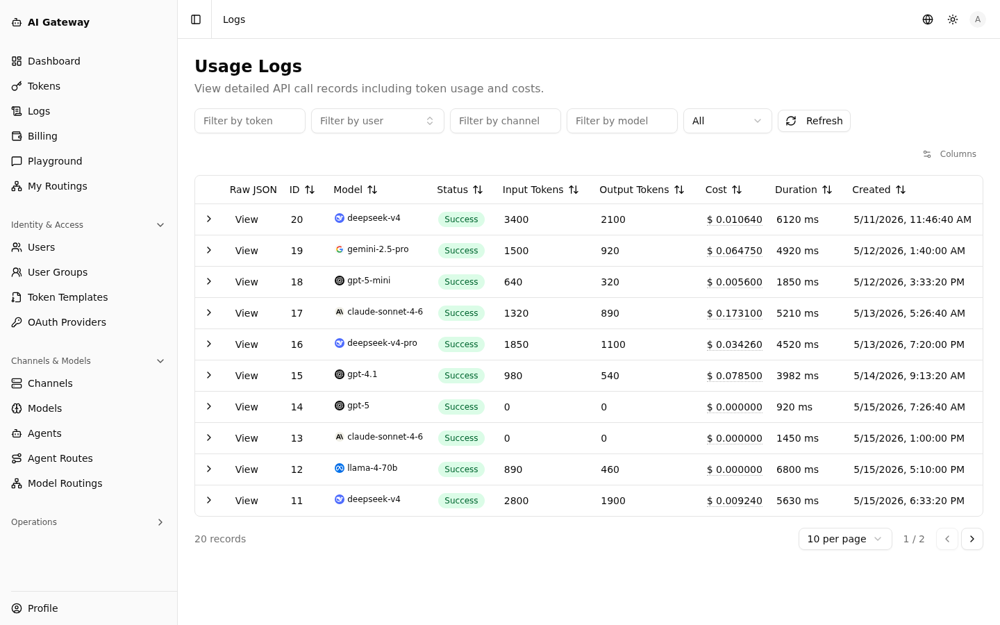
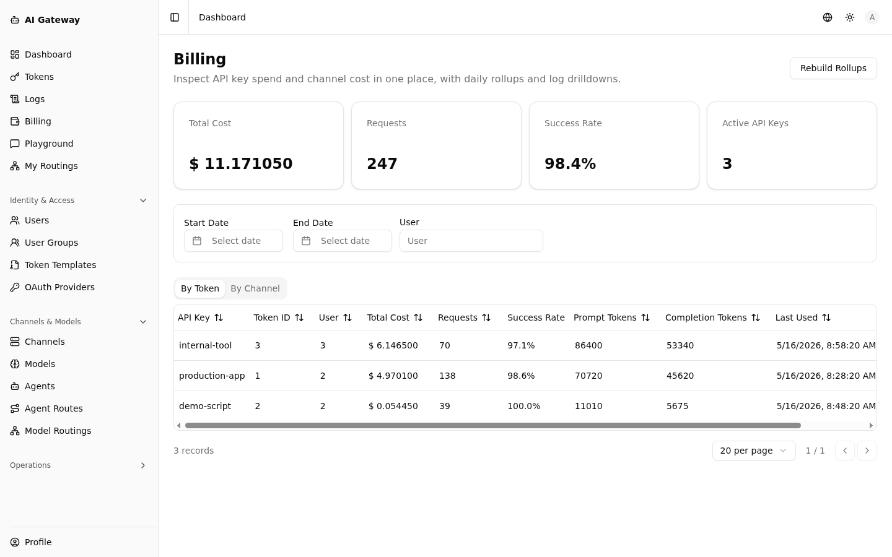
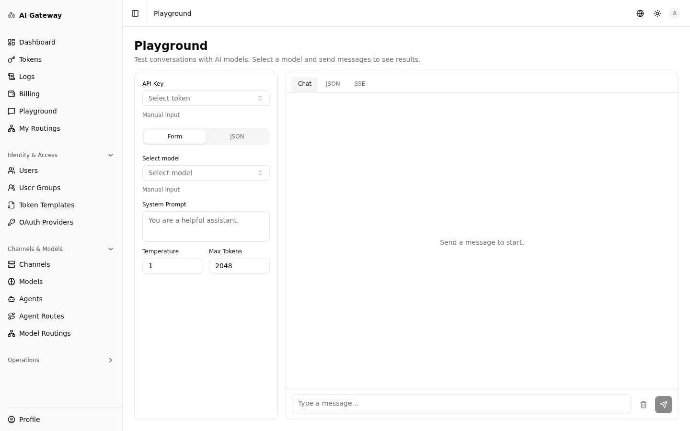

> My Blog: https://vaala.cat/posts/vibe-ai-gateway-oss/

# AI Gateway

A distributed-by-design AI API gateway with a separated control-plane (master) / data-plane (agent) architecture. Provides OpenAI/Claude-compatible `/v1/*` relay endpoints, built-in management APIs, Web UI, and single-binary distributed deployment.

[中文文档](README.zh.md)

## Features

- **Control Plane Management** — Users (groups), tokens, channels, models, and agents
- **Data Plane Relay** — OpenAI/Claude-compatible API endpoints (`/v1/chat/completions`, `/v1/responses`, `/v1/messages`, etc.) with automatic cross-protocol conversion
- **Real-Time Config Sync** — Master/agent incremental sync over WebSocket; lightweight distributed deployment with zero external dependencies
- **Multi-Region Routing** — Route requests from region A to agents in region B, enabling cross-region load balancing and bypassing regional restrictions
- **Quota & Billing** — Usage-based settlement and quota enforcement
- **Model Routing** — Aggregate multiple upstream models under one name with priority/weight load balancing and error retries
- **BYOK (Bring Your Own Key)** — End-users can self-serve upload their own provider API keys (AES-GCM encrypted at rest); private channels are merged into the candidate pool with priority over shared admin channels, with optional service-fee billing mode
- **Single Binary** — Frontend static assets embedded; no separate web server needed

## Screenshots

<table>
  <tr>
    <td colspan="2"><a href="docs/images/en/dashboard.png"></a></td>
  </tr>
  <tr>
    <td width="50%"><a href="docs/images/en/channels.png"></a><br/><sub><b>Channels</b> — upstream provider configuration</sub></td>
    <td width="50%"><a href="docs/images/en/models.png"></a><br/><sub><b>Models</b> — per-model pricing</sub></td>
  </tr>
  <tr>
    <td><a href="docs/images/en/model-routings.png"></a><br/><sub><b>Model Routings</b> — priority/weight aggregation</sub></td>
    <td><a href="docs/images/en/logs.png"></a><br/><sub><b>Usage Logs</b> — per-request audit trail</sub></td>
  </tr>
  <tr>
    <td><a href="docs/images/en/billing.png"></a><br/><sub><b>Billing</b> — daily rollups by token and channel</sub></td>
    <td><a href="docs/images/en/playground.png"></a><br/><sub><b>Playground</b> — in-browser chat tester</sub></td>
  </tr>
</table>

[See all 20 screenshots →](docs/screenshots.md)

## Architecture

```
┌─────────────────────────────────────────────────────┐
│                   master (control plane)             │
│  ┌──────────┐  ┌──────────┐  ┌───────────────────┐ │
│  │ Admin API│  │  Web UI  │  │ Agent Sync Hub    │ │
│  │ & Auth   │  │ (embed)  │  │ (WebSocket)       │ │
│  └──────────┘  └──────────┘  └───────────────────┘ │
│  ┌──────────────────────────────────────────────┐   │
│  │         Billing & Quota Settlement           │   │
│  └──────────────────────────────────────────────┘   │
└─────────────────────────────────────────────────────┘
          │ WebSocket sync
          ▼
┌─────────────────────────────────────────────────────┐
│                   agent (data plane)                 │
│  ┌──────────────┐  ┌────────────┐  ┌────────────┐  │
│  │ /v1/* Relay  │  │ Token/Chan │  │  Usage     │  │
│  │ Endpoints    │  │ Cache      │  │  Reporter  │  │
│  └──────────────┘  └────────────┘  └────────────┘  │
└─────────────────────────────────────────────────────┘
```

### Deployment Topologies

| Topology                              | Pros                                                  | Cons                                        | Use Case                              |
| ------------------------------------- | ----------------------------------------------------- | ------------------------------------------- | ------------------------------------- |
| Single node (master + embedded agent) | Simplest setup; one container                         | Shared resources; single point of failure   | PoC, testing, small production        |
| Multi-node (master + external agents) | Horizontal scaling; fault isolation; geo-distribution | Higher ops complexity; enrollment lifecycle | Medium/large production, multi-region |

## Quick Start

```bash
# 1. Prepare config
mkdir -p deploy data
cp config.example.yaml deploy/config.yaml
# Edit deploy/config.yaml — set jwt_secret and admin_password

# 2. Run with Docker Compose
export AI_GATEWAY_IMAGE=vaalacat/ai-gateway:latest
docker compose up -d

# 3. Access
# Web UI: http://localhost:8140
# Health: http://localhost:8140/ping
```

## Configuration

The configuration file accepts these top-level keys:

- `log_level` — Logging verbosity (debug, info, warn, error)
- `master` — Control plane settings (listen address, DB, JWT, admin credentials)
- `agent` — Data plane settings (listen address, master URL, enrollment)
- `runtime` — Optional advanced tuning (timeouts, heartbeat, retry)

See [`config.example.yaml`](config.example.yaml) for a complete template.

### Generic API Gateway

Administrators can import an OpenAPI 3.0 or 3.1 JSON document from **API
Services → Import OpenAPI**. Review the detected server and Route groups before
importing. After import, open the Service detail page to edit the platform copy
of the document or export a sanitized OpenAPI document. The platform copy is
the source of truth after import; upload the exported document to repeat the
workflow in another Service.

Users open **API Catalog**, select one of their Tokens, then browse only the
Services, Routes, paths, and operations that Token can invoke. The operation
view substitutes path parameters, builds the final public URL, and can send an
online request. An explicit Route is invoked at:

```text
/v1/api/{service_slug}/{route_slug}
/v1/api/{service_slug}/{route_slug}/{subpath...}
```

Documents whose routable paths begin at `/` or with a path parameter can create
an empty-slug root Route. It keeps the Route segment out of the public URL:

```text
/v1/api/{service_slug}
/v1/api/{service_slug}/{dynamic_path...}
```

Route authorization is a prefix boundary, not an OpenAPI operation allow-list.
Once a Token can invoke a Route, runtime enforcement uses that Route's protocol,
combined allowed HTTP methods, and subpath policy; it does not grant or deny
individual OpenAPI operations independently. Split operations into separate
Routes when they require different access grants.

For rolling upgrades, upgrade the Master before enabling Generic API traffic,
then upgrade every Agent that can be selected as an execution Agent. A remote
Agent must advertise `generic_api_execution_v1` (and
`generic_api_websocket_v1` for WebSocket routes); otherwise the request is
rejected with HTTP 503 before its body is forwarded. The Monitoring → Delivery
page shows Agent usage drops, trace slimming, and the Master log backlog.

### Core and Log Databases

The master stores application and billing-critical state in `core.db`, request,
trace, and analytics history in `log.db`, and uses `master.db` as the legacy
single-database source during an upgrade. These paths are configured with
`master.core_db_path`, `master.log_db_path`, and `master.legacy_db_path` and
must resolve to different SQLite files. The deprecated `master.db_path` key is
treated as the legacy source so existing deployments can upgrade without a
configuration rewrite; sibling `core.db` and `log.db` paths inherit its SQLite
DSN options.

An unavailable log database degrades log-backed pages and metrics without
stopping quota settlement or billing facts. New non-critical logs enter a
simple bounded delivery queue. When its configured entry or byte limit is
reached, the oldest pending log may be dropped; billing data is never put in
that queue. The System page reports the database and queue state and provides
explicit retry and clear-backlog actions.

There is no automatic log retention. Administrators can manually clear the six
derived analytics tables from the System page:

- `usage_hourly_buckets`
- `usage_duration_histograms`
- `usage_ttft_histograms`
- `usage_tps_histograms`
- `usage_user_ttft_histograms`
- `usage_user_tps_histograms`

During an online upgrade, the existing `/data/master.db` keeps its name and is
opened as the read-only legacy source. The new targets are `core.db` and
`log.db`. Background backfill may reach `caught_up`, but migration becomes
`completed` only after an administrator runs the final pass. Do not delete the
legacy source before completion.

Older v5 installations may also leave a `*.pre-split.bak`. This is an
independent legacy artifact: it is not an input to the new backfill and must not
overwrite or be restored as `core.db`. After validation and migration
completion, an administrator may retain or clean it up separately.

Rolling back to an older image does not automatically merge new state written
to `core.db` or `log.db` back into the legacy database. Evaluate that data
window before a rollback.

## Deployment

### Single Node (Docker Compose)

See the [Quick Start](#quick-start) section above. Full details in [`docker-compose.yml`](docker-compose.yml).

### Multi-Node (External Agents)

1. Generate an enrollment token from master
2. Configure agent with `master_url` and `enrollment_token`
3. Start with `docker compose -f docker-compose.yml -f docker-compose.agent.yml up -d`

See [`docker-compose.agent.yml`](docker-compose.agent.yml) for the overlay template.

### Kubernetes

See [`docs/k8s-deployment.md`](docs/k8s-deployment.md) for Kubernetes deployment guidance.

## Development

```bash
# Prerequisites: Go 1.25+, Node.js 20+, pnpm

# Build (frontend + backend)
CGO_ENABLED=0 bash ./build.sh

# Run the same checks and resource limits as GitHub CI
./scripts/ci.sh

# Frontend dev server (port 8141, proxies to :8140)
cd web && pnpm install && pnpm dev
```

## Releasing

Releases are cut by pushing a `v*` git tag. GitHub Actions builds a multi-arch
image (linux/amd64 + linux/arm64) and pushes it to
[Dockerhub](https://hub.docker.com/r/vaalacat/ai-gateway).

```bash
# Stable release — also updates :latest
git tag v1.2.3
git push origin v1.2.3

# Pre-release — pushes :v1.2.3-rc1 only, does NOT update :latest
git tag v1.2.3-rc1
git push origin v1.2.3-rc1
```

The git tag is injected into the binary as `internal/version.Version`.

## Contributing

See [CONTRIBUTING.md](CONTRIBUTING.md) for development setup, code style, and PR process.

## Acknowledgments

This project supports native code (purely self-developed, supporting chat, response, and messages protocols), while other protocols are supported by the new-api channel.

It builds upon the work of the following:

- **[new-api](https://github.com/QuantumNous/new-api)** by [@QuantumNous](https://github.com/QuantumNous) — the legacy channel adaptor, 50+ upstream provider constants, model-fetch protocols, and token-counting utilities are reused via `github.com/QuantumNous/new-api`. Without this prior work, out-of-the-box support for 50+ providers would not be feasible. Sincere thanks to the new-api maintainers and contributors.

- **[datatype](https://github.com/franktisellano/datatype)** by [@franktisellano](https://github.com/franktisellano) — variable OpenType font (SIL OFL 1.1) used for inline sparklines in the UI. See `web/public/fonts/OFL.txt`.

## License

[MIT](LICENSE)
